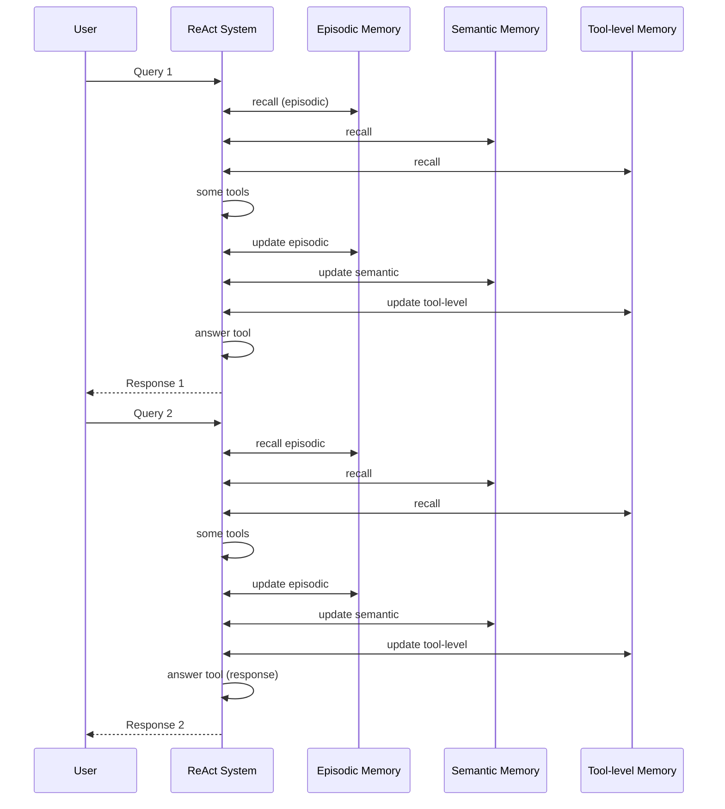

```mermaid
sequenceDiagram
    participant U as User
    participant R as ReAct System
    participant EM as Episodic Memory
    participant SM as Semantic Memory
    participant TM as Tool-level Memory

    %% First interaction
    U->>R: Query 1
    R<<->>EM: recall (episodic)
    R<<->>SM: recall
    R<<->>TM: recall

    R->>R: some tools

    %% Update phase
    R<<->>EM: update episodic
    R<<->>SM: update semantic
    R<<->>TM: update tool-level

    R->>R: answer tool
    R-->>U: Response 1

    %% Second interaction
    U->>R: Query 2
    R<<->>EM: recall episodic
    R<<->>SM: recall
    R<<->>TM: recall

    R->>R: some tools

    %% Update phase
    R<<->>EM: update episodic
    R<<->>SM: update semantic
    R<<->>TM: update tool-level

    R->>R: answer tool (response)
    R-->>U: Response 2
```