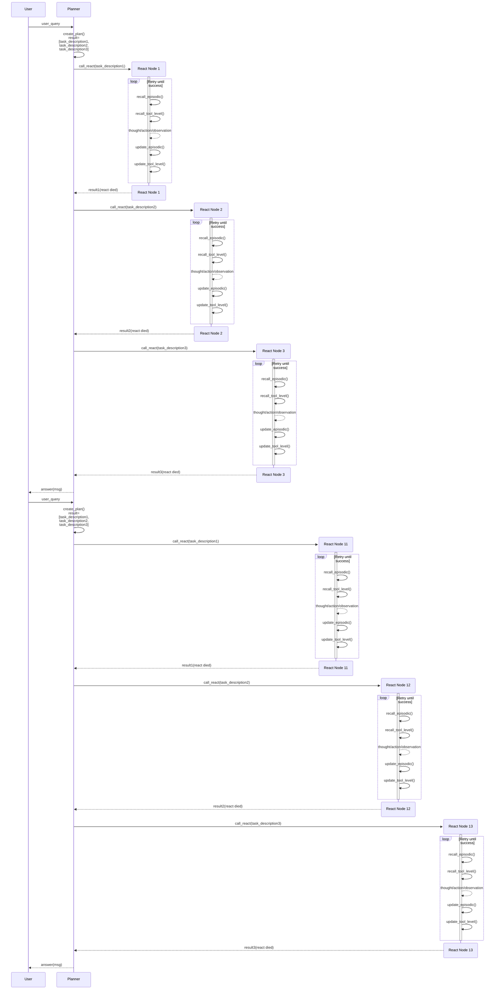

```mermaid
sequenceDiagram
    participant U as User
    participant P as Planner

    U->>P: user_query

    %% Generate plan
    P->>P: create_plan()<br/>result=<br/>[task_description1,<br/> task_description2,<br/> task_description3]

    %% Execute tasks sequentially
    create participant R1 as React Node 1
    P->>R1: call_react(task_description1)
    activate R1
    loop Retry until success
        R1->>R1: recall_episodic()
        R1->>R1: recall_tool_level()
        R1-->>R1: thought/action/observation
        R1->>R1: update_episodic()
        R1->>R1: update_tool_level()
    end
    deactivate R1
    destroy R1
    R1-->>P: result1(react died)
    
    create participant R2 as React Node 2
    P->>R2: call_react(task_description2)
    activate R2
    loop Retry until success
        R2->>R2: recall_episodic()
        R2->>R2: recall_tool_level()
        R2-->>R2: thought/action/observation
        R2->>R2: update_episodic()
        R2->>R2: update_tool_level()
    end
    deactivate R2
    destroy R2
    R2-->>P: result2(react died)

    create participant R3 as React Node 3
    P->>R3: call_react(task_description3)
    activate R3
    loop Retry until success
        R3->>R3: recall_episodic()
        R3->>R3: recall_tool_level()
        R3-->>R3: thought/action/observation
        R3->>R3: update_episodic()
        R3->>R3: update_tool_level()
    end
    deactivate R3
    destroy R3
    R3-->>P: result3(react died)

    %% Final answer
    P-->>U: answer(msg)

    U->>P: user_query

    %% Generate plan
    P->>P: create_plan()<br/>result=<br/>[task_description1,<br/> task_description2,<br/> task_description3]

    %% Execute tasks sequentially
    create participant R11 as React Node 11
    P->>R11: call_react(task_description1)
    activate R11
    loop Retry until success
        R11->>R11: recall_episodic()
        R11->>R11: recall_tool_level()
        R11-->>R11: thought/action/observation
        R11->>R11: update_episodic()
        R11->>R11: update_tool_level()
    end
    deactivate R11
    destroy R11
    R11-->>P: result1(react died)
    
    create participant R12 as React Node 12
    P->>R12: call_react(task_description2)
    activate R12
    loop Retry until success
        R12->>R12: recall_episodic()
        R12->>R12: recall_tool_level()
        R12-->>R12: thought/action/observation
        R12->>R12: update_episodic()
        R12->>R12: update_tool_level()
    end
    deactivate R12
    destroy R12
    R12-->>P: result2(react died)

    create participant R13 as React Node 13
    P->>R13: call_react(task_description3)
    activate R13
    loop Retry until success
        R13->>R13: recall_episodic()
        R13->>R13: recall_tool_level()
        R13-->>R13: thought/action/observation
        R13->>R13: update_episodic()
        R13->>R13: update_tool_level()
    end
    deactivate R13
    destroy R13
    R13-->>P: result3(react died)

    %% Final answer
    P-->>U: answer(msg)
```