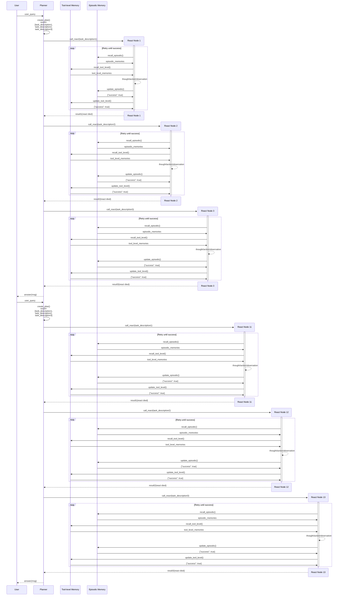

```mermaid
sequenceDiagram
    participant U as User
    participant P as Planner
    participant T as Tool-level Memory
    participant E as Episodic Memory

    U->>P: user_query

    %% Generate plan
    P->>P: create_plan()<br/>result=<br/>[task_description1,<br/> task_description2,<br/> task_description3]

    %% Execute tasks sequentially
    create participant R1 as React Node 1
    P->>R1: call_react(task_description1)
    activate R1
    loop Retry until success
        R1->>E: recall_episodic()
        E->>R1: episodic_memories
        R1->>T: recall_tool_level()
        T->>R1: tool_level_memories
        R1-->>R1: thought/action/observation
        R1->>E: update_episodic()
        E->>R1: {"success": true}
        R1->>T: update_tool_level()
        T->>R1: {"success": true}
    end
    deactivate R1
    destroy R1
    R1-->>P: result1(react died)
    
    create participant R2 as React Node 2
    P->>R2: call_react(task_description2)
    activate R2
    loop Retry until success
        R2->>E: recall_episodic()
        E->>R2: episodic_memories
        R2->>T: recall_tool_level()
        T->>R2: tool_level_memories
        R2-->>R2: thought/action/observation
        R2->>E: update_episodic()
        E->>R2: {"success": true}
        R2->>T: update_tool_level()
        T->>R2: {"success": true}
    end
    deactivate R2
    destroy R2
    R2-->>P: result2(react died)

    create participant R3 as React Node 3
    P->>R3: call_react(task_description3)
    activate R3
    loop Retry until success
        R3->>E: recall_episodic()
        E->>R3: episodic_memories
        R3->>T: recall_tool_level()
        T->>R3: tool_level_memories
        R3-->>R3: thought/action/observation
        R3->>E: update_episodic()
        E->>R3: {"success": true}
        R3->>T: update_tool_level()
        T->>R3: {"success": true}
    end
    deactivate R3
    destroy R3
    R3-->>P: result3(react died)

    %% Final answer
    P-->>U: answer(msg)

    U->>P: user_query

    %% Generate plan
    P->>P: create_plan()<br/>result=<br/>[task_description1,<br/> task_description2,<br/> task_description3]

    %% Execute tasks sequentially
    create participant R11 as React Node 11
    P->>R11: call_react(task_description1)
    activate R11
    loop Retry until success
        R11->>E: recall_episodic()
        E->>R11: episodic_memories
        R11->>T: recall_tool_level()
        T->>R11: tool_level_memories
        R11-->>R11: thought/action/observation
        R11->>E: update_episodic()
        E->>R11: {"success": true}
        R11->>T: update_tool_level()
        T->>R11: {"success": true}
    end
    deactivate R11
    destroy R11
    R11-->>P: result1(react died)
    
    create participant R12 as React Node 12
    P->>R12: call_react(task_description2)
    activate R12
    loop Retry until success
        R12->>E: recall_episodic()
        E->>R12: episodic_memories
        R12->>T: recall_tool_level()
        T->>R12: tool_level_memories
        R12-->>R12: thought/action/observation
        R12->>E: update_episodic()
        E->>R12: {"success": true}
        R12->>T: update_tool_level()
        T->>R12: {"success": true}
    end
    deactivate R12
    destroy R12
    R12-->>P: result2(react died)

    create participant R13 as React Node 13
    P->>R13: call_react(task_description3)
    activate R13
    loop Retry until success
        R13->>E: recall_episodic()
        E->>R13: episodic_memories
        R13->>T: recall_tool_level()
        T->>R13: tool_level_memories
        R13-->>R13: thought/action/observation
        R13->>E: update_episodic()
        E->>R13: {"success": true}
        R13->>T: update_tool_level()
        T->>R13: {"success": true}
    end
    deactivate R13
    destroy R13
    R13-->>P: result3(react died)

    %% Final answer
    P-->>U: answer(msg)
```