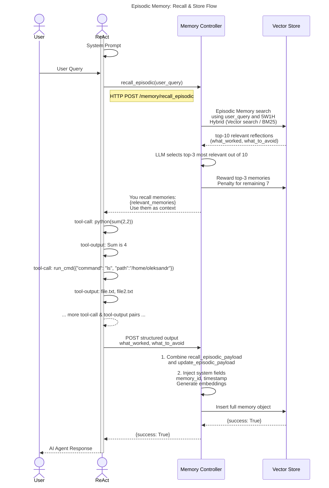

### Sequence Diagram

```mermaid
sequenceDiagram
    title Episodic Memory: Recall & Store Flow

    actor User
    actor ReAct
    participant MC as Memory Controller
    participant VS as Vector Store

    activate ReAct

    ReAct->>ReAct: System Prompt
    User->>ReAct: User Query

    ReAct->>MC: recall_episodic(user_query)
    Note right of ReAct: HTTP POST /memory/recall_episodic

    MC->>VS: Episodic Memory search<br/>using user_query and 5W1H<br/>Hybrid (Vector search / BM25)
    VS-->>MC: top-10 relevant reflections<br/>(what_worked, what_to_avoid)

    MC->>MC: LLM selects top-3 most relevant out of 10

    MC->>VS: Reward top-3 memories<br/>Penalty for remaining 7

    MC-->>ReAct: You recall memories:<br/>{relevant_memories}<br/>Use them as context

    ReAct->>ReAct: tool-call: python(sum(2,2))
    ReAct->>ReAct: tool-output: Sum is 4

    ReAct->>ReAct: tool-call: run_cmd({"command": "ls", "path":"/home/oleksandr"})
    ReAct->>ReAct: tool-output: file.txt, file2.txt

    ReAct-->>ReAct: ... more tool-call & tool-output pairs ...

    ReAct->>MC: POST structured output<br/>what_worked, what_to_avoid

    MC->>MC: 1. Combine recall_episodic_payload<br/>and update_episodic_payload<br/><br/>2. Inject system fields<br/>memory_id, timestamp<br/>Generate embeddings

    MC->>VS: Insert full memory object

    VS-->>MC: {success: True}

    MC-->>ReAct: {success: True}

    ReAct-->>User: AI Agent Response

    deactivate ReAct
```
