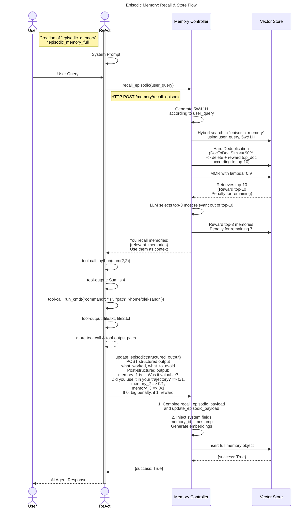

### Sequence Diagram

```mermaid
sequenceDiagram
    title Episodic Memory: Recall & Store Flow

    actor User
    actor ReAct
    participant MC as Memory Controller
    participant VS as Vector Store

    activate ReAct
    Note left of ReAct: Creation of "episodic_memory",<br/> "episodic_memory_full"

    ReAct->>ReAct: System Prompt
    User->>ReAct: User Query

    ReAct->>MC: recall_episodic(user_query)
    Note right of ReAct: HTTP POST /memory/recall_episodic

    MC->>MC: Generate 5W&1H<br/>according to user_query

    MC->>VS: Hybrid search in "episodic_memory"<br/>using user_query, 5w&1H

    MC->>VS: Hard Deduplication<br/>(DocToDoc Sim >= 90%<br/>--> delete + reward top_doc<br/>according to top-10)

    MC->>VS: MMR with lambda=0.9

    VS-->>MC: Retrieves top-10<br/>(Reward top-10<br/>Penalty for remaining)

    MC->>MC: LLM selects top-3 most relevant out of top-10

    MC->>VS: Reward top-3 memories<br/>Penalty for remaining 7

    MC-->>ReAct: You recall memories:<br/>{relevant_memories}<br/>Use them as context

    ReAct->>ReAct: tool-call: python(sum(2,2))
    ReAct->>ReAct: tool-output: Sum is 4

    ReAct->>ReAct: tool-call: run_cmd({"command": "ls", "path":"/home/oleksandr"})
    ReAct->>ReAct: tool-output: file.txt, file2.txt

    ReAct-->>ReAct: ... more tool-call & tool-output pairs ...

    ReAct->>MC: update_episodic(structured_output)<br/>POST structured output<br/>what_worked, what_to_avoid<br/>Post-structured output:<br/>memory_1 is ... Was it valuable?<br/>Did you use it in your trajectory? => 0/1,<br/>memory_2 => 0/1,<br/>memory_3 => 0/1<br/>If 0: big penalty, if 1: reward

    MC->>MC: 1. Combine recall_episodic_payload<br/>and update_episodic_payload<br/><br/>2. Inject system fields<br/>memory_id, timestamp<br/>Generate embeddings

    MC->>VS: Insert full memory object

    VS-->>MC: {success: True}

    MC-->>ReAct: {success: True}

    ReAct-->>User: AI Agent Response

    deactivate ReAct
```
