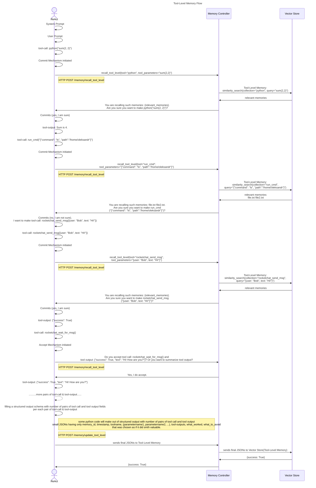

### Sequence Diagram

```mermaid
%%{init: {'themeVariables': { 
    'fontSize': '28px',
    'sequenceNumberFontSize': '28px',
}}}%%
sequenceDiagram
    title Tool-Level Memory Flow

    actor ReAct
    participant MC as Memory Controller
    participant VS as Vector Store

    activate ReAct

    ReAct->>ReAct: System Prompt
    ReAct->>ReAct: User Prompt
    ReAct->>ReAct: tool-call: python("sum(2, 2)")
    ReAct->>ReAct: Commit Mechanism initiated

    ReAct->>MC: recall_tool_level(tool="python", tool_parameters="sum(2,2)")
    Note right of ReAct: HTTP POST /memory/recall_tool_level

    MC->>VS: Tool-Level Memory:<br/>similarity_search(collection="python", query="sum(2,2)")
    VS->>MC: relevant memories

    MC->>ReAct: You are recalling such memories: {relevant_memories}.<br/>Are you sure you want to make python("sum(2, 2)")?

    ReAct->>ReAct: Commits (yes, I am sure)
    ReAct->>ReAct: tool-output: Sum is 4.

    ReAct->>ReAct: tool-call: run_cmd("{"command": "ls", "path":"/home/oleksandr"}")

    ReAct->>ReAct: Commit Mechanism initiated

    ReAct->>MC: recall_tool_level(tool="run_cmd",<br/>tool_parameters="{"command": "ls", "path":"/home/oleksandr"}")
    Note right of ReAct: HTTP POST /memory/recall_tool_level

    MC->>VS: Tool-Level Memory:<br/>similarity_search(collection="run_cmd",<br/>query="{"command": "ls", "path":"/home/oleksandr"}")

    VS->>MC: relevant memories:<br/>file.txt file2.txt

    MC->>ReAct: You are recalling such memories: file.txt file2.txt.<br/>Are you sure you want to make run_cmd<br/>("{"command": "ls", "path":"/home/oleksandr"}")?

    ReAct->>ReAct: Commits (no, I am not sure).<br/>I want to make tool-call: rocketchat_send_msg({user: "Bob", text: "Hi!"})

    ReAct->>ReAct: tool-call: rocketchat_send_msg({user: "Bob", text: "Hi!"})
    ReAct->>ReAct: Commit Mechanism initiated

    ReAct->>MC: recall_tool_level(tool="rocketchat_send_msg",<br/>tool_parameters="{user: "Bob", text: "Hi!"}")
    Note right of ReAct: HTTP POST /memory/recall_tool_level

    MC->>VS: Tool-Level Memory:<br/>similarity_search(collection="rocketchat_send_msg",<br/>query="{user: "Bob", text: "Hi!"}")

    VS->>MC: relevant memories

    MC->>ReAct: You are recalling such memories: {relevant_memories}.<br/>Are you sure you want to make rocketchat_send_msg<br/>("{user: "Bob", text: "Hi!"}")?

    ReAct->>ReAct: Commits (yes, I am sure)
    ReAct->>ReAct: tool-output: {"success": True}

    ReAct->>ReAct: tool-call: rocketchat_wait_for_msg()
    ReAct->>ReAct: Accept Mechanism initiated

    ReAct->>MC: Do you accept tool call: rocketchat_wait_for_msg() and<br/> tool output: {"success": True, "text": "Hi! How are you?"}? Or you want to summarize tool output?
    Note right of ReAct: HTTP POST /memory/recall_tool_level

    MC->>ReAct: Yes, I do accept.

    ReAct->>ReAct: tool-output: {"success": True, "text": "Hi! How are you?"}

    ReAct-->>ReAct: ..........more pairs of tool-call & tool-output......

    ReAct->>ReAct: filling a structured output schema with number of pairs of tool call and tool output fields<br/>per each pair of tool-call & tool-output

    Note right of ReAct: some python code will make out of structured output with number of pairs of tool call and tool output<br/>small JSONs having only memory_id, timestamp, toolname, (parametername1, parametername2, ...), tool-outputs, what_worked, what_to_avoid<br/>that was chosen as if it did smth valuable.
    Note right of ReAct: HTTP POST /memory/update_tool_level

    ReAct->>MC: sends final JSONs to Tool-Level Memory
    MC->>VS: sends final JSONs to Vector Store(Tool-Level Memory)
    VS->>MC: {success: True}
    MC->>ReAct: {success: True}
```